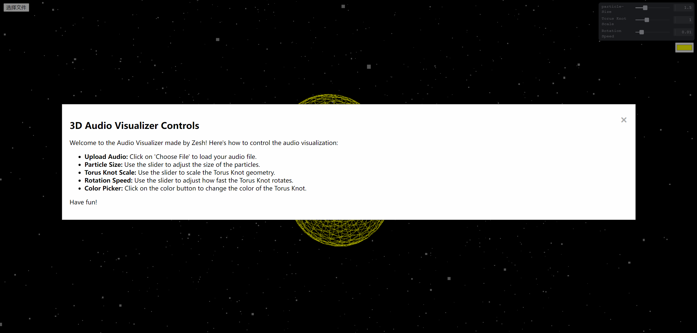
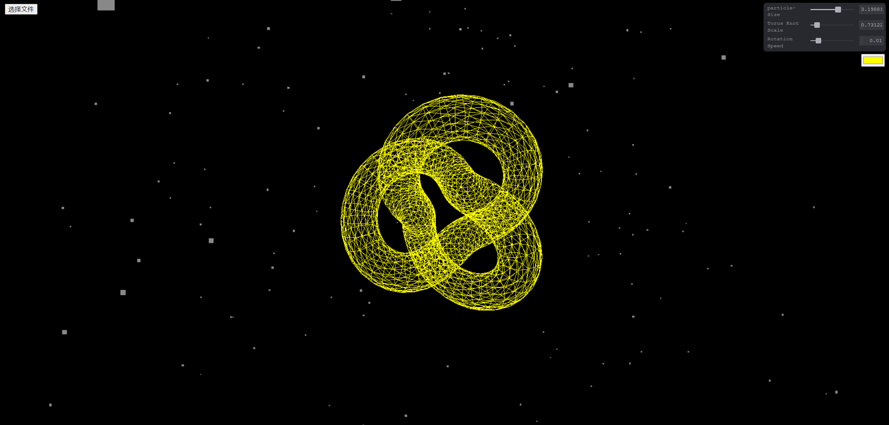

Readme
---

## Zesh - Audio Visualizer Using Three.js

Hosting link: http://a4-zeshengchen.glitch.me

This project is a 3D audio visualizer built with Three.js and the Web Audio API. It creates an interactive experience that allows users to visualize audio files in a 3D space. The visualizer showcases dynamic particle systems and a Torus Knot geometry that react to the frequency and amplitude of the audio being played.
### Goal
The goal of the application is to provide users a way to experience their music by visualizing audio data in real time. Users can choose their own audio to play, creating a unique interactive experience that is both engaging and informative.

### Challenges
**Audio Processing**:
Synchronizing the visual effects with the audio playback was hard, implementing the Web Audio API for the audio data was challenging

**Three.js Visualization**:
Overcoming learning curves with Three.js and WebGL to create a 3D visualization that responds to the audio data

**User Interaction**:
Tweakpane is powerful but also requires certain time to understand as well 

## Instructions
The application is designed to be intuitive. A modal window will pop up when the application first loads, which provides enough details on how to interact with the visualizer

## Credits
**Song used for testing**: Boomwhacker.wav by mayonaka123 -- https://freesound.org/s/410443/ -- License: Creative Commons 0

You are welcome to use this audio file which is inside of the project file, but you can also choose your own audio to have different experiences