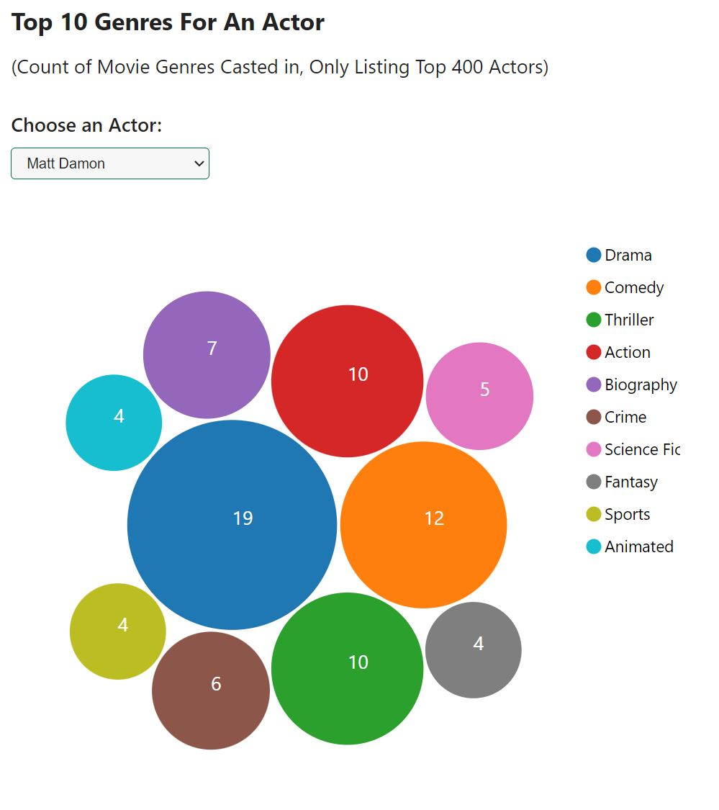

Assignment 4 - Creative Coding: Interactive Multimedia Experiences
===

## Movie Data Visualization

http://a4-jacklafond.glitch.me

## Summary:

This app uses D3 and the data from https://raw.githubusercontent.com/prust/wikipedia-movie-data/master/movies.json to create a movie data visualization app. The data from the json source includes a movie title, the year it came out, its cast, its genres, and soem other information. In my app I provide 4 visualizations, a total movies by year line chart, a total movies by year line chart that plots the top 5 genres over that time span, a top 10 actors by genre bar chart, and a top 10 genres by actor bubble chart. User interactions include a toggle-able info page, start and end year parameters for the line charts, a drop down select for the bar chart genre, and a drop down select for the bubble chart actor. 

- the goal of the application was to create some fun and interactive visualizations with d3 and to explore the movie data set
- some challenges I faced was filtering and aggregating the data as needed for each chart. It took some time to learn about how to use differnt javascript and d3 methods to get these aggregations working. It also took some time to get the d3 pack working for the bubble chart, as it needed to read the data in a 1 level hierarchy native to d3. Some other challenges inlcude only taking the top 400 actors for the select options, as having too many was slowing down the system. I also had to use regex to clean up these entries as some entries were errors in the data. 
- on load the info popup display, click the toggle button to hide it. Also the charts may take a little bit to load. Lastly, the select charts need you to select an actor or genre to populate as I have it set to onchange interactions.

## Images:

- Line Charts

- Bar Chart

- Bubble Chart
